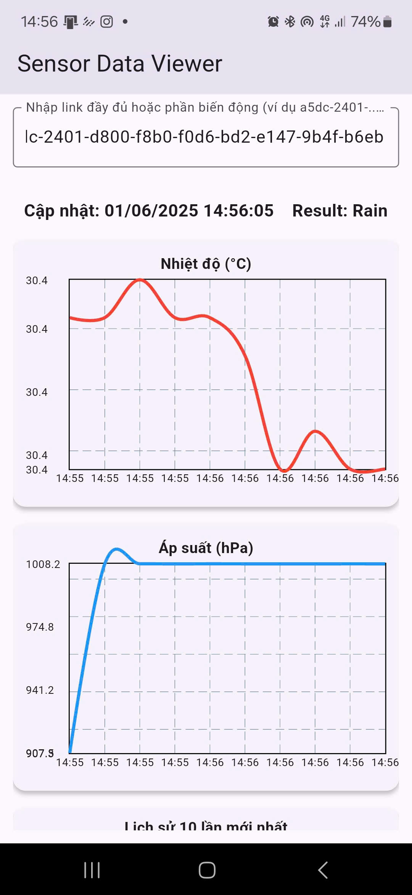
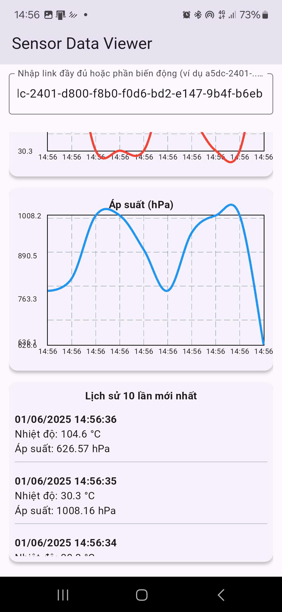
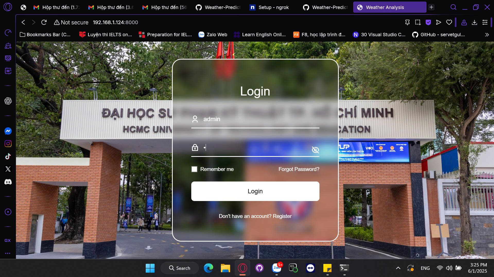
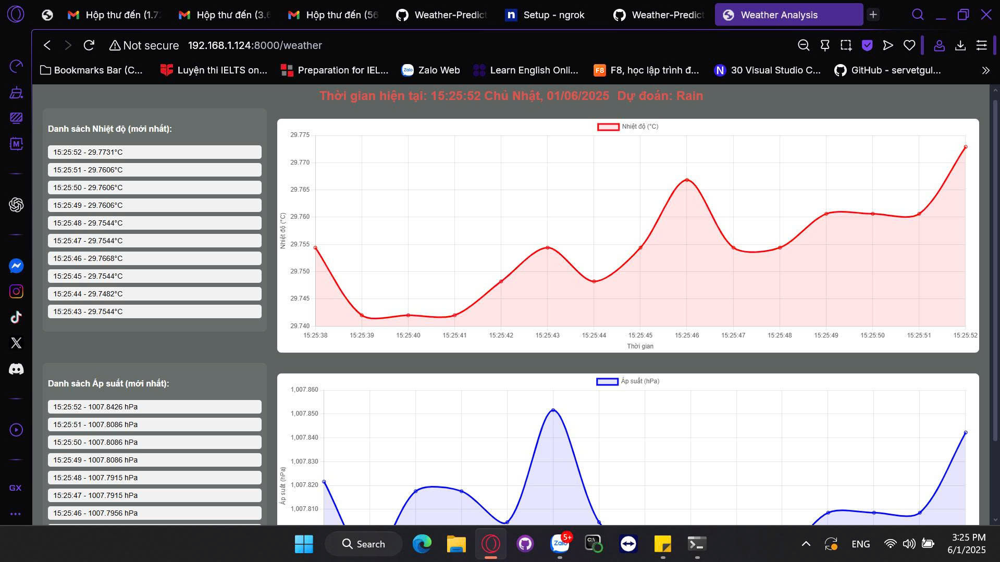
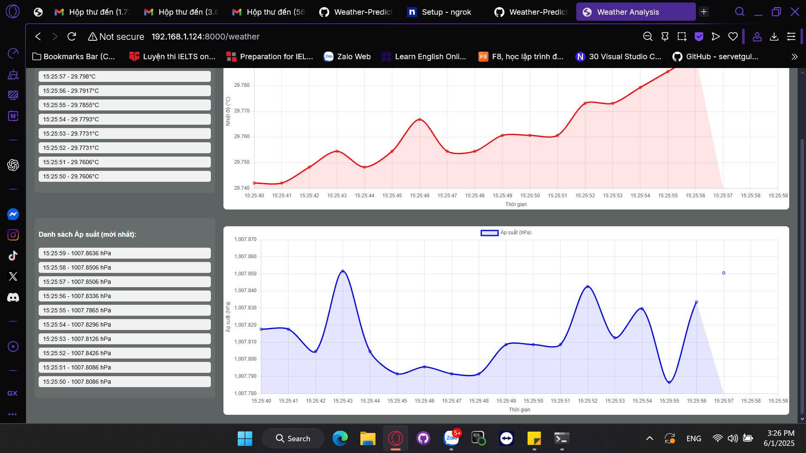

Nguyễn Châu Tấn Cường - 23146007

# Weather-Prediction-Using-Machine-Learning-Based + BMP180-Driver + Deploy Web + App(Phone)







- This is a Linux device driver for the BMP180 pressure and temperature sensor using the I2C interface. The driver allows user-space applications to communicate with the sensor through a character device and uses the `ioctl` interface for issuing commands to retrieve temperature and pressure data.

### Hardware requirements

- [Raspberry Pi 3 Model B+](https://raspberrypi.vn/san-pham/raspberry-pi-3-model-b)
- [BMP180](https://hshop.vn/cam-bien-ap-suat-khong-khi-bmp180)

### Driver Structure
#### Driver and Device

* **Driver name**: `bmp180_driver`
* **Device node**: `/dev/bmp180`
* **Device class**: `bmp180`

#### Hardware Communication

* Communicates with the BMP180 sensor over the I2C bus.
* Uses sensor registers such as `BMP180_REG_CONTROL`, `BMP180_REG_RESULT`, and commands like `BMP180_CMD_TEMP` and `BMP180_CMD_PRESS`.

#### Main Functions

* `bmp180_read_raw()`: Reads raw temperature or pressure data from the sensor.
* `bmp180_ioctl()`: Interface for user-space to request temperature or pressure data using `ioctl`.
* `bmp180_open()` and `bmp180_release()`: Handle open and close operations on the character device.
* `bmp180_probe()` and `bmp180_remove()`: Handle initialization and cleanup when the sensor is detected or removed.
* `bmp180_init()` and `bmp180_exit()`: Register and unregister the driver module when it is loaded or removed from the kernel.

### IOCTL Interface

```
| ------------------------- | -------------------------------- |
| IOCTL Command             | Description                      |
| ------------------------- | -------------------------------- |
| `BMP180_IOCTL_READ_TEMP`  | Read temperature from the sensor |
| `BMP180_IOCTL_READ_PRESS` | Read pressure from the sensor    |
| ------------------------- | -------------------------------- |
```

### Device Tree Binding

This driver supports Device Tree binding using the compatible string:
```
"bosch,bmp180"
```

### Connect

```
 +-----+-----+---------+------+---+---Pi 3B+-+---+------+---------+-----+-----+
 | BCM | wPi |   Name  | Mode | V | Physical | V | Mode | Name    | wPi | BCM |
 +-----+-----+---------+------+---+----++----+---+------+---------+-----+-----+
 |     |     |    3.3v |      |   |  1 ||    |   |      | 5v      |     |     |
 |   2 |   8 |   SDA.1 | ALT0 | 1 |  3 ||    |   |      | 5v      |     |     |
 |   3 |   9 |   SCL.1 | ALT0 | 1 |  5 || 6  |   |      | 0v      |     |     |
 +-----+-----+---------+------+---+----++----+---+------+---------+-----+-----+
 ``` 

### Clone project

```
git clone https://github.com/aysinemu/BMP180-Driver.git](https://github.com/aysinemu/Weather-Prediction-Using-Machine-Learning-Based-on-BMP180-Sensor-Data.git

cd ./App/BMP180-Driver
```

### Building and Installing the Module

```
Step 0 : Add BMP180 to your Device Tree.

cd /boot

ls #Find your Ras

sudo dtc -I dtb -O dts -o Your_Ras.dts Your_Ras.dtb

sudo nano Your_Ras.dts

Find i2c@7e804000 in Your_Ras.dts and replace that with this

i2c@7e804000 {
        compatible = "brcm,bcm2835-i2c";
        reg = <0x7e804000 0x1000>;
        interrupts = <0x02 0x15>;
        clocks = <0x08 0x14>;
        #address-cells = <0x01>;
        #size-cells = <0x00>;
        status = "disabled";
        pinctrl-names = "default";
        pinctrl-0 = <0x15>;
        clock-frequency = <0x186a0>;
        phandle = <0x2b>;
        bmp180@77 {
                    compatible = "bosch,bmp180";
                    reg = <0x77>;
            };
};

Ctrl+0 and Enter

Ctrl+X

sudo dtc -I dts -O dtb -o Your_Ras.dtb Your_Ras.dts

sudo raspi-config - Turn on I2C

sudo reboot

Step 1 : Check if it has the BMP module; if so, remove it.

lsmod | grep bmp

sudo rmmod module_name

Step 2 : Check if you have connected your module to the Raspberry Pi 3+, and if it reacts correctly.

sudo i2cdetect -y 1

Show : 
     0  1  2  3  4  5  6  7  8  9  a  b  c  d  e  f
00:                         -- -- -- -- -- -- -- -- 
10: -- -- -- -- -- -- -- -- -- -- -- -- -- -- -- -- 
20: -- -- -- -- -- -- -- -- -- -- -- -- -- -- -- -- 
30: -- -- -- -- -- -- -- -- -- -- -- -- -- -- -- -- 
40: -- -- -- -- -- -- -- -- -- -- -- -- -- -- -- -- 
50: -- -- -- -- -- -- -- -- -- -- -- -- -- -- -- -- 
60: -- -- -- -- -- -- -- -- -- -- -- -- -- -- -- -- 
70: -- -- -- -- -- -- -- 77           

Step 3 : Find EEPROM.

gcc -o eeprom eeprom.c

sudo ./eeprom

Show :
  AC1 = 8492
  AC2 = -1056
  AC3 = -14273
  AC4 = 33682
  AC5 = 25835
  AC6 = 15882
  B1  = 6515
  B2  = 36
  MB  = -32768
  MC  = -11786
  MD  = 2311

Step 4 : Install driver.

Make

sudo insmod bmp180_driver.ko

Step 5 : Install enviroments (Using Venv or Conda).

pip install -r requirements.txt

Step 6 : Monitor on Web 

sudo web:app --host 0.0.0.0 --port 8000 --reload

Step 7 : Install ngrok

Link: https://dashboard.ngrok.com/get-started/setup/raspberrypi

Step 8 :  Ngrok

ngrok http http://localhost:8000 (Same port with web)

Step 9 : Plug your phone to computer and install the App (APK) - Make sure to install Flutter SDK first

flutter devices #Check your devices
flutter build apk --release
flutter install

Step 10 : Unplug your phone and use normally
```

### User/Pass

* `User`:  admin - `Pass`:  1
* `User`:  guest - `Pass`:  1

### Uninstalling the Module

```
sudo rmmod bmp180_driver
```


### Run User Interface Code

```
gcc -o test_bmp test_bmp.c

sudo ./test_bmp
```

### Example of testing

```
pi@raspberrypi:~/Desktop/driver $ sudo ./test_bmp 
Temperature (raw): 25121
Pressure (raw): 41956
```

### Tips

Show the kernel log to check the install state or instantiated:
```
dmesg | tail 
```

To scan I2C bus 1 for connected I2C devices:
```
i2cdetect -y 1
```

To list all module installed:

```
ls /dev
```

### Data:

```
HCM Weather Data

python data.py

python opti.py

Link Web : https://www.worldweatheronline.com/weather-api/ (scaler.pkl)
```

### Model:

* `Decision_Tree.pkl`
* `Gradient_Boosting.pkl`
* `KNN.pkl`
* `SVM.pkl`
* `Logistic_Regression.pkl`
* `Naive_Bayes.pkl`
* `Neural_Network.pkl`
* `Random_Forest.pkl`
